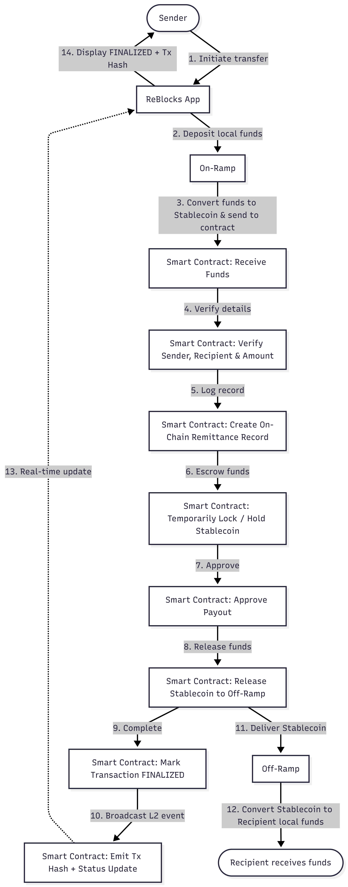

# ✈️ ReBlocks

ReBlocks is a blockchain-powered cross-border remittance platform designed to make international money transfers faster, more transparent, and more affordable for OFWs sending money home and freelance workers receiving payments from overseas clients.

Traditional remittance services often charge high fees, include hidden exchange rate markups, and can take hours or even days to process. ReBlocks solves this by using Morph as a low-cost blockchain settlement layer combined with fiat-to-stablecoin conversion and local payout infrastructure.

Users can send or receive money using familiar payment methods such as card or bank transfer. Funds are converted into USDC, securely routed through a smart contract on Morph for verification and transparent on-chain tracking, then converted back into local currency and delivered directly through GCash, Maya, or bank accounts.

By making blockchain invisible to the end user, ReBlocks delivers a seamless remittance experience while enabling lower fees, faster settlement, and 24/7 transfers. Our goal is to provide a more accessible and low-cost financial solution for workers and families across the Philippines and Southeast Asia.

---

## 🔗 Live Links & Interactive Demos

[🌐 **Landing Page**](https://reblocksdemo.vercel.app/) &nbsp;&nbsp;•&nbsp;&nbsp; [🤖 **Android APK**](https://expo.dev/artifacts/eas/4bUh4PB8gp17tgFwH2k2yX.apk) &nbsp;&nbsp;•&nbsp;&nbsp; [🍏 **iOS Build**](https://expo.dev/artifacts/eas/tpH8F7twbEz7peNeFD3yY7.tar.gz)

---

## ✨ Key Features & Innovation

ReBlocks is engineered to bring decentralized speed and security into a product that feels like a traditional, everyday banking application.

### 🌐 1. Ultra-Low Cost Cross-Border Remittance

- **Fiat-to-Stablecoin Bridge:** Converts sender's local fiat currency into USDC instantly. Funds are securely routed through our smart contracts on **Morph L2** to ensure 100% transparent on-chain tracking.
- **90% Cheaper Fees:** Bypasses traditional SWIFT correspondent banking networks, cutting down expensive transfer fees and hidden exchange rate markups.
- **Instant Liquidity:** Money is settled securely over the blockchain, ready to be cashed out in the recipient's country within seconds, rather than days.

### 🤖 2. x402 Conversational Smart Agent (All-Ages Friendly)

- **Natural Conversational Payouts:** Send money, check FX rates, and track transactions using natural language (e.g., _"Send ₱1,200 to Mom"_ or _"What's the exchange rate?"_).
- **Grandparent-Ready Accessibility:** Designed for **all generations**. Tech-averse users and older family members who have zero knowledge of Web3 can easily operate ReBlocks because it's as simple as chatting on a messenger app.
- **Real-Time Fee Estimation:** Queries Morph L2 RPC nodes dynamically to calculate and display exact transaction fees directly within the chat interface.

### 🧱 3. Invisible Web3 Infrastructure

- **Abstracted Wallet UX:** Sign up with standard email and password. Payouts are routed server-side, eliminating the need for external wallets, private keys, or pre-funded gas.
- **High-Speed Settlement:** Funds are settled on the ultra-fast **Morph L2 blockchain** in seconds, bypassing the multi-day delays of traditional SWIFT transfers.
- **Smart Contract Safety:** Leverages secure ERC-20 payment routing protocols with real-time on-chain hashes generated on the fly.

### 🌏 4. Instant Local Payouts (Southeast Asia Coverage)

ReBlocks routes settled stablecoin assets instantly into the exact regional payment providers and banks supported in the app:

- **Philippines (🇵🇭):** `GCash` · `Maya` · `BDO` · `BPI`
- **Singapore (🇸🇬):** `DBS` · `OCBC` · `UOB` · `GrabPay`
- **Thailand (🇹🇭):** `Bangkok Bank` · `Kasikorn Bank` · `SCB` · `TrueMoney`
- **Vietnam (🇻🇳):** `Vietcombank` · `BIDV` · `VietinBank` · `MoMo`
- **Malaysia (🇲🇾):** `Maybank` · `CIMB` · `Public Bank` · `Touch n Go`
- **Indonesia (🇮🇩):** `BCA` · `Mandiri` · `BRI` · `GoPay`

---

## 🏗️ Technical Architecture Diagram

ReBlocks bridges Web2 convenience with Web3 efficiency by routing stablecoin assets securely over Morph L2 and releasing them instantly to payment networks.



---

## 🛠️ Running the Code Locally

### Prerequisites

- Node.js
- npm or yarn
- Expo Go app on your physical device (optional, for native testing)

### Installation & Execution

1. Clone this repository:
   ```bash
   git clone https://github.com/mtrsvn/ReBlocks
   cd ReBlocks
   ```
2. Install client dependencies:
   ```bash
   npm install
   ```
3. Start the React Native development server:
   ```bash
   npx expo start
   ```
   _Scan the QR code in your terminal with your phone's camera (iOS) or Expo Go app (Android) to run._
